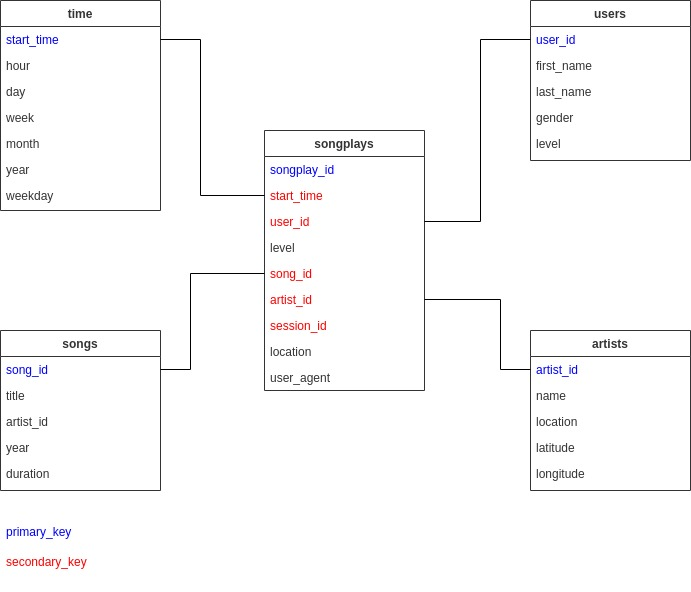

# Udacity Data Engineering Nanodegree Project 1: Data Modeling With Postgres
This project consists in the practical application of the knowledge obtained so far about data modeling with SQL database. The main purpose of this work is to create a database and perform a ETL process of data related to a fictitious app called Sparkfy.

## Data Schema
A star schema structure was create in this database. It contains the following tables.

## How All Those Files Were Used
At first, after understanding the instructions, I had to fill in the `sql_queries.py` file. Here all the variables that will be responsible to drop, create and insert informations in our tables were filled in. There is also a query at the end of file that was used to feed a table in our process.

After all that variables were ready, we needed to run the `create_tables.py` file so we could proceed to the `etl.ipynb` to create the etl codes. I personally prefered to insert a cell in the etl notebook to execute the `create_tables.py` file to make things easier. In the etl notebook, all the information requested to generate the tables were provided. After all was done, and no more errors were displayed after the cells execution *(and I generated a lot of them in the process... a lot, really)* the connection to the data base was closed and I could proceed to the checks with the `test.ipynb`.  

The `test.ipynb` was executed and here was where I remembered to set the constraints in the table creation. I just left one message without treating because i do not believe it make much sense. But more on that on the next section.

Next, I full-filled the `etl.py` file and considered the job done. But, not before writing this README.md file.

## Challenges faced during the project
When I was trying to make the `etl.ipynb` file in my computer I was able to get the week number by using `.dt.isocalendar().week`. But, when I tryed to perform the same operation in Udacity's workspace I encountered an error and I had to use `.dt.week` instead. Maybe this is due to different versions of python/pandas in my and Udacity's environments.

Another interesting thing that happened was that I set the `start_time` column in table *time* as integer. But when trying to populate the table I faced the error `DataError: integer out of range`. So, after some googling I came out with the solution presented in this [page](https://www.geocene.com/tech/backend/2021/09/12/dataerror-integer-range-postgres-django). Basically, the **INT** data type does not support this information and, in order to get things working, we need to set this column as **BIGINT**. When was time to validate the job done in `etl.ipynb` with `test.ipynb` notebook it was suggested to set this column as **INT**. Since I faced the issued above I decided to simply ignore this sugestion. 

The last thing I learned with this project is that when you use SERIAL as a column data type you have to set that column in the insert SQL command as default. I got an error when I was trying to insert values in the `songplays` table, so I had to make this adjust. References I read about this topic: 
[Instructions on how to insert data in SERIAL column data type](https://stackoverflow.com/questions/12836043/how-to-insert-a-record-into-a-table-with-a-column-declared-with-the-serial-funct) 
[Information about serial column](https://www.postgresql.org/docs/15/datatype-numeric.html#DATATYPE-SERIAL)