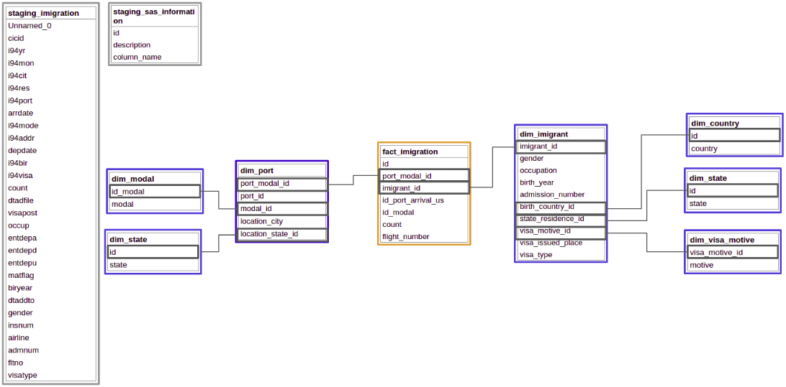

# Udacity's Capstone Project

# <font color='red'>Still pending:
Adjust `dim_port` query. For finishing the `dim_port` problem I need to retrieve the last value from `staging_airport`'s "iata_code" ordering by `ident` which does not repeat in the entire table. Keep working over this query below:<br>
```sql
select
    iata_code,
    ident,
    LAST_VALUE(ident) OVER(PARTITION BY iata_code ORDER BY ident DESC) AS last_register
from staging_airport_codes
GROUP BY 1,2
HAVING iata_code in ('DZI')
```
</font>

## Important Observation
This project consists on a series of python scripts to be executed in a specific order, to be displayed, in order to generate a Data Warehouse in Redshift containing information on imigration to the US _(project suggested by Udacity)_.

## Tables Needed
`airport-codes_csv.csv`
`imigration_data_sample.csv`
`I94_SAS_Labels_Descriptions.SAS`

Since all the data in `I94_SAS_Labels_Descriptions.SAS` are formatted in a particular way we need to run the `reading_sas_file.py` first to retrieve all the data we need. After running it the files `sas_descriptive_information.csv` will be generated. This files, with the `airport-codes_csv.csv` and `imigration_data_sample.csv`, will help us generate all the staging tables needed to create the tables for our final schema.

## Execution Order

1) Execute `create_cluster_aws.py` file. _Creates the necessary infracstructure on AWS Cloud_;
2) Execute `reading_sas_file` file. _Exports all the necessary id and values from the SAS file as a unique .csv file_;
3) Create a S3 bucket, named as `nogfel-imigration`, in the same region where the redshift cluster was created _(us-west-2)_;
4) Create folders named as `airport_data`, `imigration_data` and `sas_data` on the root of `nogfel-imigration`;
5) Upload the `airport-codes_csv.csv` to `airport_data` folder;
6) Upload the `immigration_data_sample.csv` to `imigration_data` folder;
6) Upload the `sas_descriptive_information.csv` to `sas_data` folder;
7) Execute `create_and_load_tables.py` file. _Creates and loads the tables necessary for the analysis._
8) Execute `quality_checks.py` file. _Checks if there are problems with the table's keys._

## Staging Tables Exploration for Necessary Data Wrangling

### `staging_airport_codes`
Table generated from `airport-code_csv.csv` table. 
This table presented itself with a little challenge because redshift was reading the comma inside the double quote as a delimiter. So, it understood that this table had one more column than it actually did. To fix this problem I used the strategy used in this [StackOverflow post](https://stackoverflow.com/questions/47290137/redshift-loading-csv-with-commas-in-a-text-field). This strategy was used in all 3 staging tables.

### `staging_imigration`
Table generated from the imigrant information available in `immigration_data_sample.csv`/parquet files.

### `sas_descriptive_information`
Table generated from the `I94_SAS_Labels_Descriptions.SAS` using the `reading_sas_file.py`. The script in .py file generates a table containing the columns: 'id', 'description' and 'column_name' from all the information we will need from the SAS file for this project. The column 'column_name' refers to the column from the imigrant table which we are generating the information.


## Data Schema To Be Generated

In the image below we can see the tables schema to be generated with this ETL process. The tables with gray contour are the staging tables, the ones in blue are dimensions tables and the fact table is in orange.


