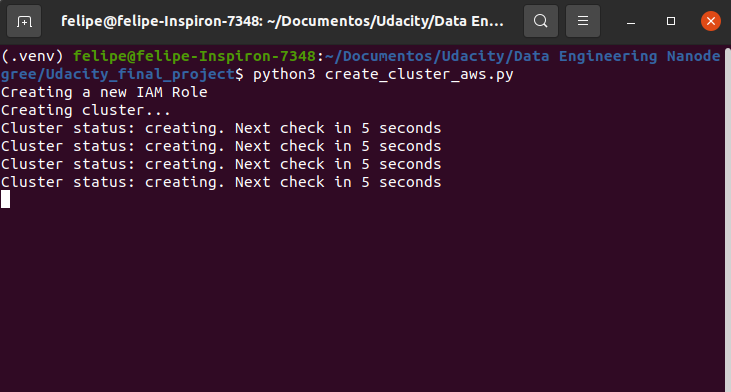
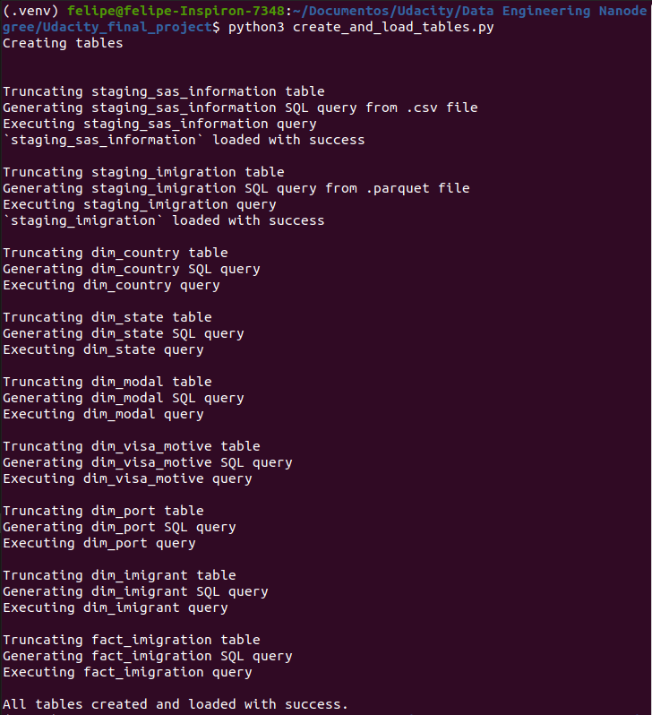

# ETL Job Execution

## `reading_sas_file.py`
File execution and it's output:

## `create_cluster_aws.py`
This file also creates a IAM Role for our user.
After the command sequence for creating the Redshift cluster is executed, the code will enter in a loop checking if the cluster is ready to use _(every 5 seconds)_.

After the cluster is ready to be used, the status will be displayed and other information will be displayed.

*_The error message displayed at the end can be ignored. Apparently, the cluster was already created with the permission that we set at the end of the code to allow it to be open to external access. So, once it already has this permission, it can not give again._ 

## `create_and_load_tables.py`
Here we create the tables in Redshift and load them using the files in the S3 bucket.

## `quality_checks.py`
Now, we perform some data quality checks looking for duplicate registers in the `id` columns for every table we have in redshift, except the staging ones.
_It takes sometime to validate the tables `dim_imigrant` and `fact_imigration`_.

